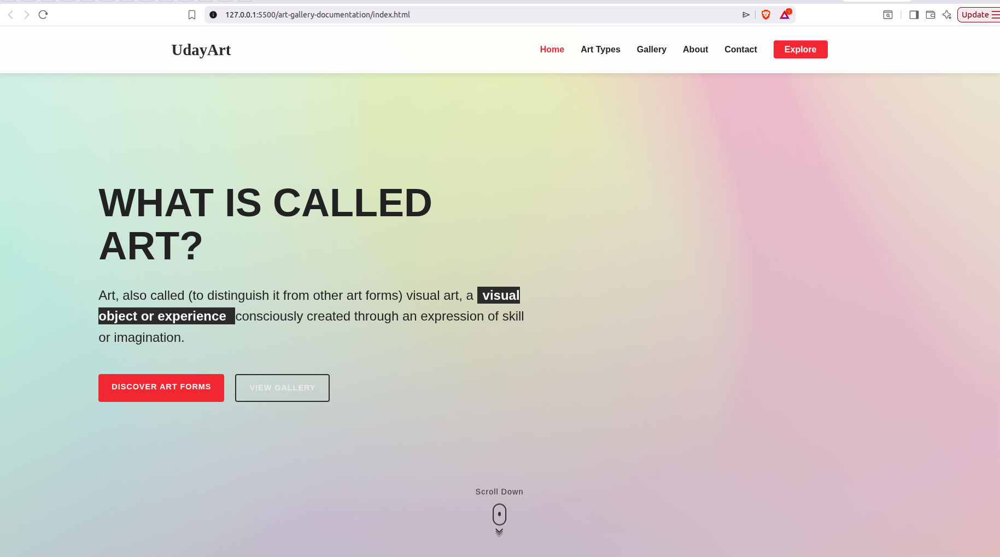
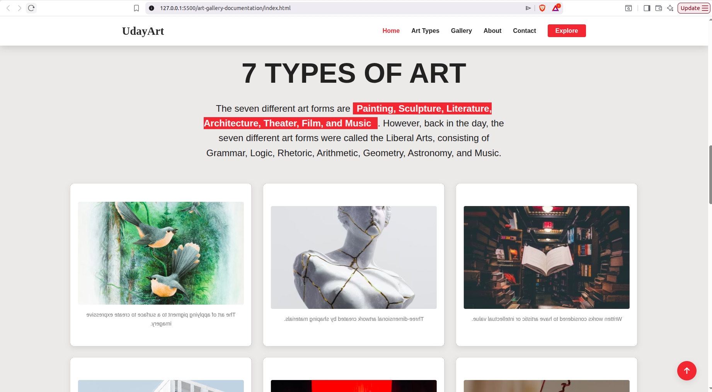
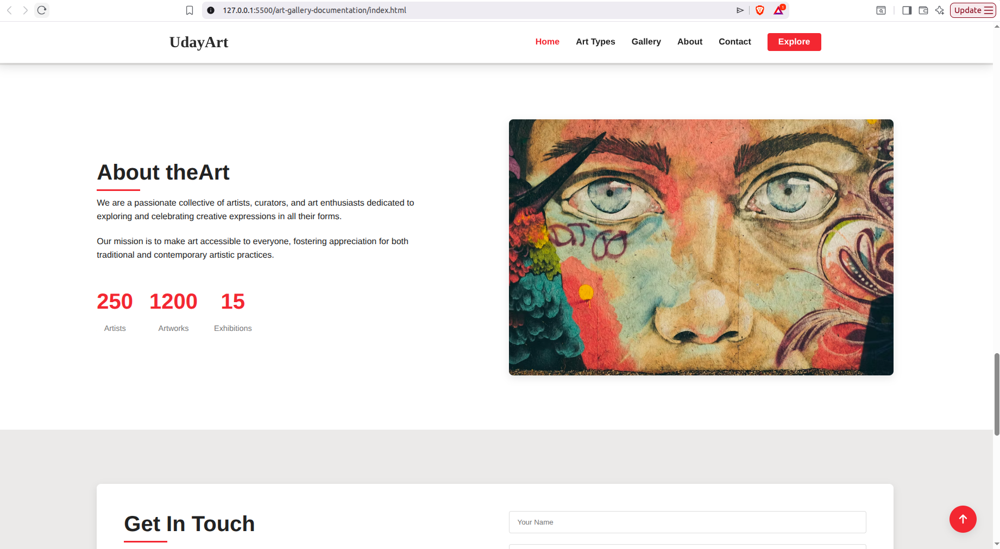
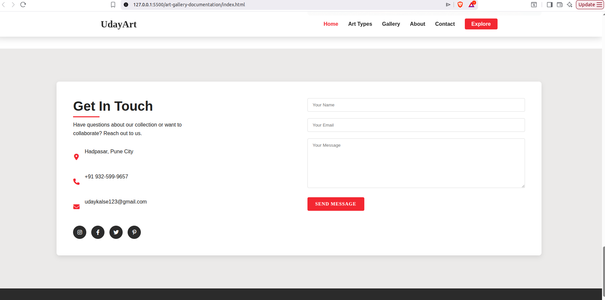
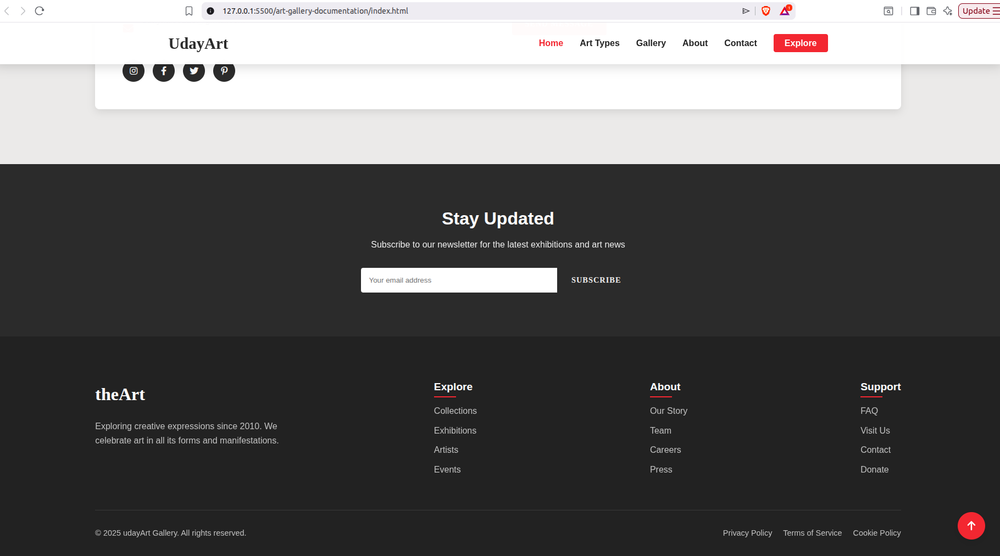
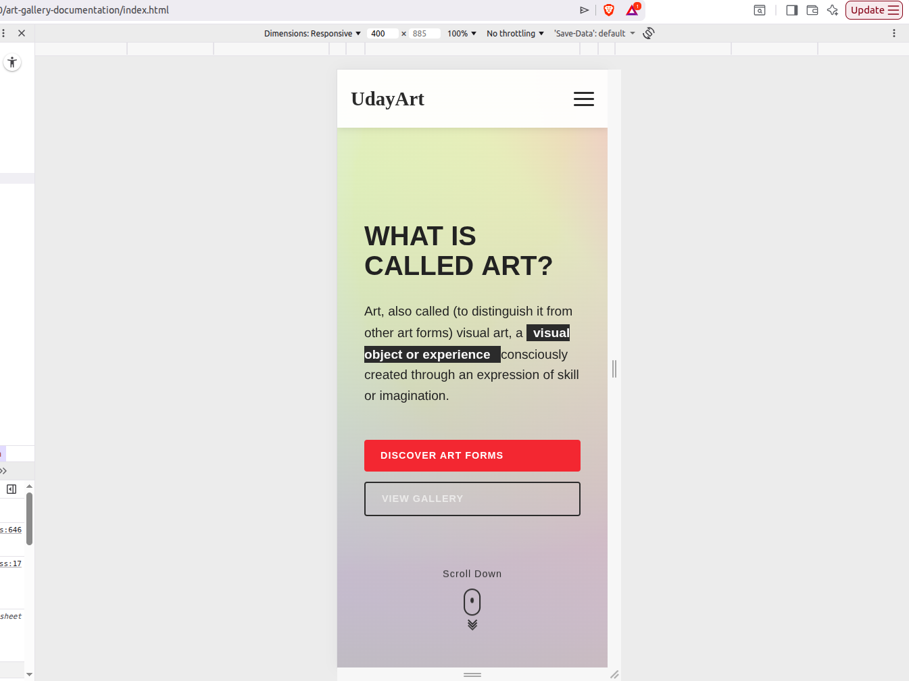

# Art Gallery Documentation

## Project Overview

The Art Gallery Documentation project provides comprehensive technical documentation for a simple interactive Art Gallery web application built with HTML, CSS, and JavaScript. The documentation follows a Docs-as-Code approach, making it easier for developers, contributors, and learners to understand the project structure, setup process, functionality, and maintenance.

This documentation serves as a portfolio project that demonstrates professional technical writing practices, including structured documentation, clear navigation, user-focused guides, and developer documentation commonly used in software development teams.

## Project Objectives
The primary objectives of this documentation are to:

- Provide clear and well-structured documentation for the Art Gallery web application.
- Help new users understand the purpose and functionality of the project.
- Guide developers through the project structure and source code organization.
- Explain the installation and setup process.
- Demonstrate professional technical writing practices using the Docs-as-Code approach.
- Improve project maintainability through organized and consistent documentation.

## Target Audience
This documentation is intended for:

- **Developers** who want to understand, modify, or extend the application.
- **Students and learners** interested in HTML, CSS, JavaScript, and technical documentation practices.
- **Contributors** who plan to improve the project or documentation.
- **Recruiters and hiring managers** who want to evaluate the project's documentation quality and development practices.
## Project Features
The Art Gallery web application provides the following features:

- Interactive gallery interface for browsing artwork.
- Responsive design for desktop, tablet, and mobile devices.
- Clean and user-friendly navigation.
- Dynamic image interactions using JavaScript.
- Modern user interface with CSS styling and animations.
- Fast loading with no external backend dependencies.
- Simple project structure suitable for learning front-end development.
## Technology Stack
| Technology | Purpose |
|------------|---------|
| HTML5 | Provides the semantic structure of the web application. |
| CSS3 | Styles the user interface, layout, and responsive design. |
| JavaScript (ES6) | Adds interactivity and dynamic behavior to the gallery. |
| Visual Studio Code | Recommended code editor for development. |
| Git | Version control for tracking project changes. |
| GitHub | Repository hosting and documentation management. |

## Project Structure

```text
art-gallery/
│
├── index.html
├── style.css
└── script.js
```

### File Description

| File | Description |
|------|-------------|
| `index.html` | The main entry point of the application. Defines the structure and content of the Art Gallery interface. |
| `style.css` | Contains all styles, including layout, typography, colors, responsive design, and animations. |
| `script.js` | Implements the application's interactive functionality using JavaScript. |

## Prerequisites

## Quick Start

Follow these steps to run the project locally:

### 1. Clone the repository

```bash
git clone https://github.com/<your-username>/art-gallery-documentation.git
```

### 2. Navigate to the project directory

```bash
cd art-gallery-documentation
```

### 3. Open the project

Open the project in your preferred code editor (for example, Visual Studio Code).

### 4. Launch the application

Open the `index.html` file in your web browser.

Alternatively, if you use the **Live Server** extension in Visual Studio Code:

1. Open the project in VS Code.
2. Right-click `index.html`.
3. Select **Open with Live Server**.
4. The application will open automatically in your default browser.

## Documentation Index

The project documentation is organized into the following guides:

| Document | Description |
|----------|-------------|
| [Getting Started](docs/getting-started.md) | Introduction to the project and how to begin. |
| [Installation Guide](docs/installation.md) | Instructions for setting up the project locally. |
| [Project Structure](docs/project-structure.md) | Overview of the project's files and organization. |
| [Features](docs/features.md) | Detailed explanation of application features. |
| [User Guide](docs/user-guide.md) | Instructions for using the Art Gallery application. |
| [Developer Guide](docs/developer-guide.md) | Information for developers working on the project. |
| [Architecture](docs/architecture.md) | High-level overview of the application's design. |
| [Troubleshooting](docs/troubleshooting.md) | Common issues and their solutions. |
| [FAQ](docs/faq.md) | Frequently asked questions about the project. |
| [Glossary](docs/glossary.md) | Definitions of technical terms used in the documentation. |
| [Contributing](docs/contributing.md) | Guidelines for contributing to the project. |
| [Changelog](docs/changelog.md) | Record of project updates and documentation changes. |

## Screenshots

The following screenshots highlight the main sections and user experience of the Art Gallery web application.

### Homepage



*The landing page featuring the hero section, navigation menu, and primary call-to-action.*

---

### Gallery Section


*Responsive gallery layout displaying artwork with interactive hover effects.*

---

### Art Types



*Interactive flip cards introducing seven different forms of art.*

---

### About Section



*About section featuring project information and animated statistics.*

---

### Contact Form



*Users can submit their contact information and messages through the client-side contact form.*

---

### Newsletter



*Newsletter subscription section with client-side confirmation.*

---

### Mobile View



*Responsive layout optimized for smaller screen sizes.*

---

### Navigation Menu


*Responsive navigation with smooth scrolling and mobile menu support.*

---

## Architecture Overview

The Art Gallery application follows a simple client-side architecture based on three core technologies.

```text
HTML
   │
   ▼
CSS ─────► User Interface
   ▲
   │
JavaScript
```

For detailed architecture diagrams and implementation details, refer to the [Architecture Guide](docs/architecture.md).

---

## Future Improvements

The following enhancements are planned for future releases:

- Advanced gallery filtering
- Artwork search functionality
- Image lightbox/modal viewer
- Dark mode support
- Accessibility improvements (WCAG)
- Backend integration for contact form
- Newsletter API integration
- Performance optimization
- Lazy loading for images
- Content Management System (CMS) support

---

## Contributing

Contributions are welcome.

Please read the [Contributing Guide](docs/contributing.md) before submitting issues, pull requests, or documentation updates.

---

## License

This project is licensed under the **MIT License**.

See the `LICENSE` file for additional details.

---

## Author

**Uday Kalse**

- GitHub: https://github.com/Udaykalse
- LinkedIn: *[( link)](https://www.linkedin.com/in/uday-k-877221391/)*