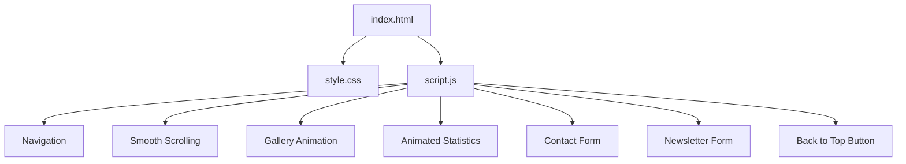
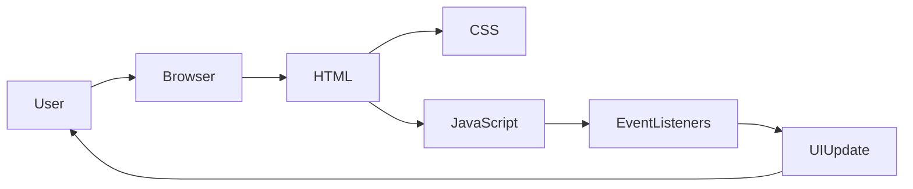

# Architecture

## Overview

The Art Gallery application follows a simple client-side architecture. All application logic executes in the user's web browser without requiring a backend server or database.

The application is composed of three primary layers:

- Structure (HTML)
- Presentation (CSS)
- Behavior (JavaScript)

These layers work together to deliver an interactive single-page web application.

---

# High-Level Architecture

---

# Application Flow

When a user opens the application:

1. The browser loads `index.html`.
2. The HTML document loads `style.css`.
3. The browser renders the page layout.
4. `script.js` is loaded.
5. The `DOMContentLoaded` event initializes interactive functionality.
6. Event listeners are registered.
7. Users interact with the application.

---

# Component Responsibilities

## HTML Layer

Responsible for:

- Page structure
- Semantic elements
- Navigation
- Forms
- Gallery content

---

## CSS Layer

Responsible for:

- Layout
- Typography
- Color scheme
- Responsive design
- Hover effects
- Animations
- Transitions

---

## JavaScript Layer

Responsible for:

- Mobile navigation
- Smooth scrolling
- Scroll-based animations
- Animated statistics
- Form interactions
- Newsletter subscription
- Back-to-top functionality

---

# Event Flow

---

# Design Principles

The application follows several front-end development principles:

- Separation of concerns
- Responsive design
- Progressive enhancement
- Event-driven interactions
- Reusable styling through CSS variables

---

# Future Architecture Improvements

Potential architectural enhancements include:

- Modular JavaScript files
- Image lazy loading
- Gallery filtering
- Search functionality
- Backend API integration
- Database support
- Authentication
- CMS integration
